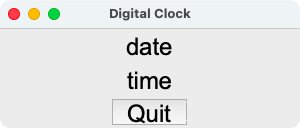

GUI Lab 1 - Digital Clock
=========================

In this lab assignment, we will create a simple digital clock application
using Tkinter.  Our application will look similar to the screenshot below.


Here is the detailed specification:
* The dimension of the application's window is defaulted to 300x100 pixels.
* The application window is displayed with the title Digital Clock.
* The first line is a label widget displaying the current date in the form of
  `<day> <month> <year>`.  The date must be updated when the application runs
  past midnight.
* The second line is another label widget displaying the current time in the
  form of `<hour>:<minute>:<second>`, which gets updated every second.
* There is also a Quit button that, once clicked, will close the application.
* All widgets' texts are displayed in the Arial font with the font size of 24
  points.


Now proceed with the following steps.

1. Define the Application class that creates a root window.  The file
   `clock.py` is already provided as your starting point.

   ```Python
    import tkinter as tk


    class Application(tk.Tk):
        def __init__(self):
            super().__init__()


    if __name__ == "__main__":
        app = Application()
        app.mainloop()
    ```

   Running the code above should result in an empty root window as shown:

   

2. Inside the `__init__()` method, add more code to set the application's title
   and default window size as described in the specification.  In addition,
   place two `Label` widgets displaying static texts as placeholders, and a Quit
   button, all appearing in the specified font as shown.  (The Quit button may
   still do nothing at this point.)

   

3. Bind the Quit button's click event to a function that closes the
   application when clicked.  Test to make sure that the application behaves
   as expected.

4. Define two control variables of type string as instance attributes, named
   `str_date` and `str_time`, to store the current date and time, respectively.
   Bind both variables to the two label widgets created earlier.  The labels
   must display the current values of these two variables as soon as they are
   updated.  For example, if the variables are updated by the statements:

    ```python
    self.str_date.set("*** Current Date ***")
    self.str_time.set("*** Current Time ***")
    ```

   Then the application window should appear like this:

   

5. Define the `update_time()` method that updates the variables `str_date` and
   `str_time` to the current date and time, respectively, with the format
   described in the specification.  This method must also schedule an event to
   call itself one second in the future.  Hint: study the `now()` and `strftime()`
   functions provided by the datetime module.

6. Add a line of code to call the `update_time()` method once at the end of
   the `__init__()` method.  Your application should now be showing current
   date and time as expected.

   


Submission
==========
Create a commit containing your complete code and push it to your repository
on GitHub Classroom.
